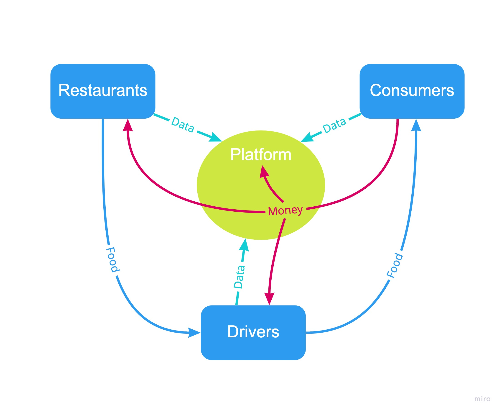
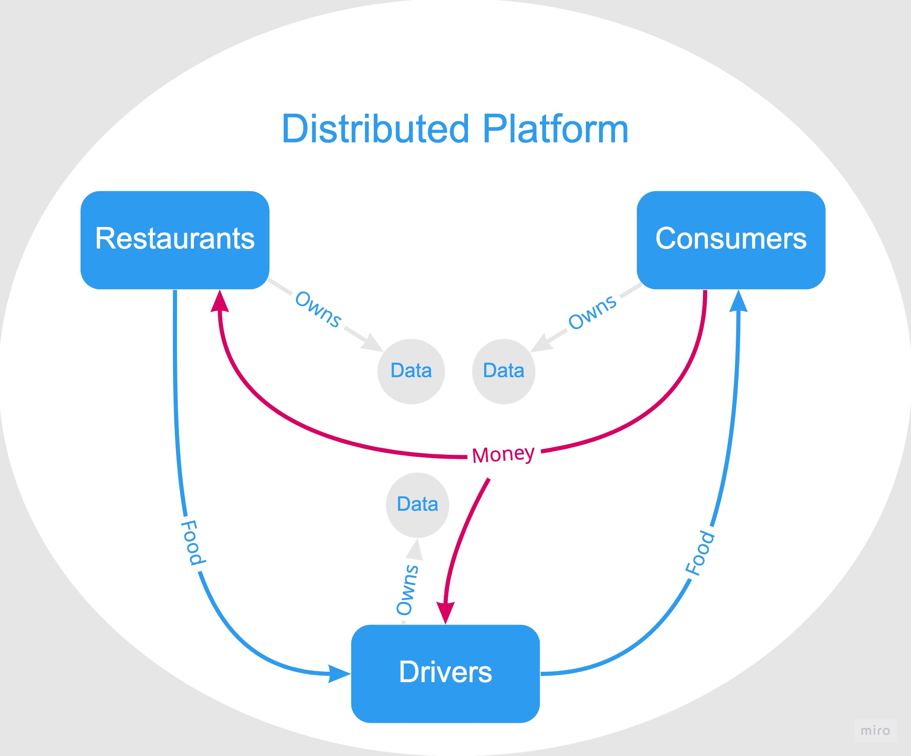

By [Aaron Haobei Song](https://linkedin.com/in/haobeisong) and [Darren Chen](https://linkedin.com/in/dstchen).

---

### Background on the food delivery industry

**Definition:** Food delivery is a courier service in which restaurants, stores or independent food delivery companies deliver food to consumers.

A prominent food delivery business model is through an online platform which aggregates restaurants, consumers and drivers all in one place such as Uber Eats and DoorDash. As is illustrated in the following diagram, food delivery platform processes food orders from the consumers and coordinate the restaurants and drivers to prepare and deliver the food to them.

- Food delivery platforms often charge an upfront payment and lasting commission fee (5% - 30%) for their services which include the establishment of the network connecting multiple restaurants, consumers and drivers and coordination among them.

- In addition, food delivery platforms collect data (both transactional and personal data) from all the participants on the platform and optimize their business operation to cut cost.

The problems with the third-party platform are:

1. The platform's incentives are not aligned with its participants. As a result, the platform tends to exploit and extract (monetary / informational) value from its participants for its own benefit.

2. The lack of transparency in the platform's operation and data usage. As an example, food delivery platforms often pit restaurants against each other and force them to offer lower than market food prices to attract consumers.

A decentralized food delivery platform hands over the ownership of the platform to the hands of its participants resulting in perfect alignment in their incentives, that is, the value created by the participants is redistributed back to them instead of a middle man, viz. a centralized platform. By leveraging the blockchain technology, all the participants of the platform can also participate in the governance of the platform effectively and efficiently. The blockchain technology can also provide unprecedented data transparency and security, which leaves each individual participant's data in their sole discretion.

